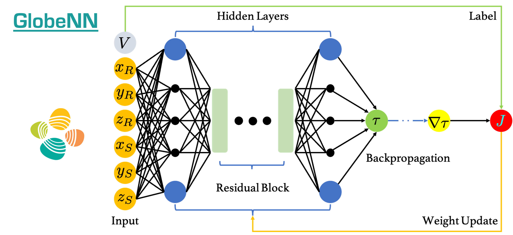

  

Reproducible material for **A Neural Network Based Global Traveltime Function (GlobeNN) - Taufik M., Waheed U., and Alkhalifah T.**


# Project structure
This repository is organized as follows:

* :open_file_folder: **asset**: folder containing logo.
* :open_file_folder: **data**: folder containing international seismic array stations locations and the required GLAD-M25 model.
* :open_file_folder: **notebooks**: set of jupyter notebooks reproducing the experiments in the paper (see below for more details).
* :open_file_folder: **saves**: folder containing pre-trained models.
* :open_file_folder: **src**: folder containing materials for the *globenn* package.

## Notebooks
The following notebooks are provided:

- :orange_book: ``Training.ipynb``: notebook to perform training of the multi-source experiments from scracth.
- :orange_book: ``Results-Subsection-1.ipynb``: notebook to reproduce the first subsection *Point-source traveltime modeling* of the *Results* section.
- :orange_book: ``Results-Subsection-2.ipynb``: notebook to reproduce the second subsection *USArray traveltime modeling* of the *Results* section.
- :orange_book: ``Results-Subsection-3.ipynb``: notebook to reproduce the first subsection *Global mantle traveltime modeling* of the *Results* section.

## Getting started
To ensure reproducibility of the results, we suggest using the `environment.yml` file when creating an environment.

Simply run:
```
./install_env.sh
```
It will take some time, if at the end you see the word `Done!` on your terminal you are ready to go. 

Remember to always activate the environment by typing:
```
conda activate globenn
```

**Disclaimer:** All experiments have been carried on a Intel(R) Xeon(R) Gold 6230R CPU @ 2.10GHz equipped with a single NVIDIA Quadro RTX 8000 GPU. Different environment configurations may be required for different combinations of workstation and GPU.

## Cite us 
Taufik M., Waheed U., and Alkhalifah T. (2023) A Neural Network Based Global Traveltime Function (GlobeNN).
